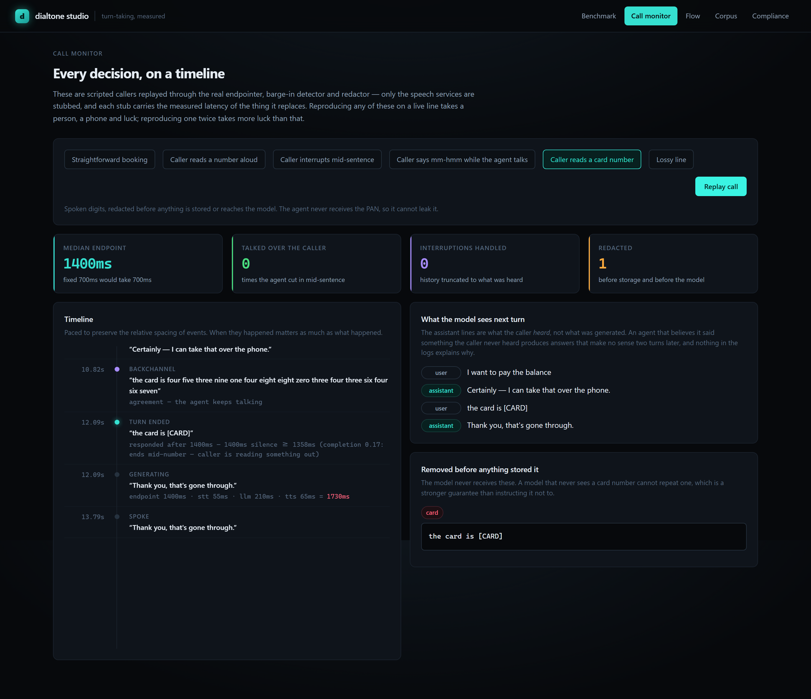

<div align="center">

# dialtone

**A voice-agent platform whose turn-taking is measured, not asserted.**

Every vendor in this space publishes a latency number. None publishes the false-cutoff rate that
came with it — yet they are the same dial. dialtone publishes the whole curve.

[](#running-it)
[](#running-it)
[](#running-it)
[](LICENSE)

</div>

---

## The claim

> **280 ms median response, 0% false cutoffs.**
> A typical fixed 700 ms threshold responds in 700 ms and talks over the caller on **16.7%** of
> unfinished turns.

2.5× faster *and* strictly more polite — not a point on the same trade-off curve, a different
curve. Every number on this page is recomputed from source by `dialtone bench ablate`; none of
it is read from a checked-in results file.


---

## Why this exists

Voice-agent latency is quoted the way fuel economy used to be: one number, measured under
conditions nobody discloses. The number is real, and it is also nearly meaningless, because
**any** latency figure is reachable by lowering the silence threshold. The only question is what
it costs — and the cost is that the agent starts talking over people.

That cost has a name, *false cutoff*, and it is not in anybody's marketing material. It should
be, because callers feel it far more sharply than they feel 200 ms of extra latency. Being
interrupted mid-sentence by a machine is the single worst experience a phone system can produce,
and it is exactly what you buy when you tune for a headline number.

So dialtone measures both, on a published corpus, and reports the curve:

| configuration | median | p90 | false cutoff | turns answered |
|---|---:|---:|---:|---:|
| baseline fixed 700 ms | 700 ms | 700 ms | 16.7% | 100% |
| adaptive, no signals | 520 ms | 520 ms | 100.0% | 100% |
| + syntax only | 380 ms | 380 ms | 0.0% | 100% |
| + prosody only | 440 ms | 800 ms | 30.6% | 100% |
| **+ both (default)** | **280 ms** | **340 ms** | **0.0%** | **100%** |

Read the second row before the last one. *Adaptive with no signals is strictly worse than the
baseline it replaces* — it interrupts every single unfinished turn. That row is in the table
because it is the honest control: the gain is not adaptivity, and it is not a luckier default
threshold. It is the two signals, and the ablation is what proves it.

---

## How it decides

The endpointer combines three sources of evidence on every 20 ms frame, and the threshold moves
continuously between 160 ms and 1800 ms:

| signal | what it reads | why a fixed threshold cannot |
|---|---|---|
| **silence** | how long the caller has been quiet | the only thing most systems use |
| **syntax** | can this sentence end here? | *"my account number is four two"* is not a finished turn no matter how long the pause |
| **prosody** | is the pitch contour falling? | a rising contour is a continuation; a falling one is a hand-off |

The decisive one is syntax, and the case that matters most is numbers read aloud:

```console
$ dialtone bench score "my account number is four two"
transcript   'my account number is four two'
completion   0.05  (ends mid-number — caller is reading something out)
threshold    1672ms of silence before responding
reading      the caller sounds unfinished

$ dialtone bench score "what appointments do you have"
transcript   'what appointments do you have'
completion   0.88  (WH-question with a fronted object, ending on 'have')
threshold    246ms of silence before responding
reading      the caller sounds complete
```

Same system, a 6.8× difference in patience, decided from the transcript. Note the second case:
`have` is normally a word that *cannot* end an utterance — but a WH-question fronts its object,
so the trailing verb really is the end. That rule exists because the **call simulator** found
the agent sitting silent for 1.6 seconds after a perfectly finished question. The isolated-turn
corpus had missed it entirely; only replaying whole conversations surfaced it.

**It is rules, not a model, and that is deliberate.** It runs in microseconds on the same thread
as the audio callback, it needs no GPU, it cannot hallucinate — and when it interrupts someone,
the reason is a line you can read and fix rather than a weight. A learned endpointer belongs
*on top* of this for the ambiguous middle, not instead of a layer that already handles the clear
cases correctly.

---

## What a caller hears, and what the model is told

The second thing this repository is about is a bug almost every voice agent has.

When a caller interrupts, the obvious handling is: stop the audio, append the agent's utterance
to the history. That is wrong, and it goes wrong two turns later rather than immediately. The
agent *generated* the whole sentence; the caller only *heard* the part that had played.


The agent generated a list of four appointment slots. The caller cut in 21% of the way through,
having heard `"I've got Tuesday at…"`. The history records **what was heard**, so the next turn
is not built on the belief that four specific slots were already offered. Without that
truncation the agent says *"as I mentioned, Tuesday at ten thirty…"* and the caller has no idea
what it is talking about — a failure where every individual component behaved correctly and
nothing in the logs explains the result.

The same detector distinguishes a genuine interruption from a **backchannel**. A caller saying
*"mm-hmm"* means *keep going*; an agent that stops dead on it cannot deliver a sentence longer
than a few words.

---

## The simulator

A voice agent is a distributed system whose integration test costs money, takes 40 seconds,
needs a human to talk to it, and cannot run in CI. So the failures that actually matter get
tested by hand, once, near a release, and then never again.

Here they are ordinary unit tests. The orchestrator, endpointer, barge-in detector, tool
registry and redactor are all the production classes; only the three speech services are
replaced, each with a deterministic stub carrying the measured p50 of the thing it stands in
for.

```console
$ dialtone call run account-number

══════════════════════════════════════════════════════════════════════════════
Caller reads a number aloud  (account-number)
The single most damaging false cutoff there is. The caller pauses twice mid-number;
a fixed 700ms threshold interrupts them both times.
══════════════════════════════════════════════════════════════════════════════
  turns 2   median endpoint 1680ms (vs 700ms fixed)   false cutoffs 0   interruptions 0
```

Note that this scenario is **slower** than the baseline, and that is the correct result. The
caller pauses for 780 ms and 820 ms in the middle of reading their account number; a fixed
700 ms threshold responds over them both times and captures half a number. Holding costs wait
time, and a benchmark that hid that cost would be dishonest — so there is a test asserting the
number-reading call is slower than an ordinary one.

Six scenarios ship: the happy path, numbers read aloud, barge-in, backchannels, a spoken card
number, and a line with 3% packet loss. Every one is deterministic — same seed, same dropped
frames, same result, every run.

---

## Compliance

On a call, sensitive data arrives one word at a time and is *spoken*, not typed. Both halves
break the usual approach.


Nobody says `4242424242424242`. They say *"four two, four two, four two…"* — so a redactor built
on digit patterns catches nothing that matters **while reporting a clean compliance record**,
which is the worst failure mode this system has. dialtone normalises spoken numbers to digits
before matching, and:

- **Luhn-checks every candidate**, so an order number survives and a card does not. Without this
  the redactor destroys the reference the agent needs to do its job.
- **Retroactively redacts.** Four digits are not a card; sixteen are — and the first four are
  already downstream. `StreamingRedactor.dirty` tells the consumer to retract what it emitted.
- **Never puts the value in the findings record.** The phone-number rule matches *inside* a card
  number, so without overlap resolution the compliance log would carry the last four digits of
  the PAN — a second copy of the breach.

The model receives the redacted text and nothing else. A model that never receives a card number
cannot leak one, which is a structurally stronger guarantee than instructing it not to. On a live
call it happens mid-stream, before the turn is stored:



---

## Flows, not prompts


A single system prompt is the fastest way to build a voice agent and the fastest way to build
one nobody can operate. The graph fixes **structure** — which tools are reachable, which
transitions are legal, what must be collected before proceeding. It never scripts the words;
scripted wording is what made IVR trees hated, and being able to say the same thing fifty ways
is the entire reason to use a language model.

```console
$ dialtone flow show
flow: dental-booking   start: greet
global tools: lookup_patient

node           kind      collects       tools reachable here                 edges
──────────────────────────────────────────────────────────────────────────────────
greet          speak                    —                                    3
identify       collect   name           lookup_patient                       2
preferred_day  collect   preferred_day  —                                    1
offer_slots    tool                     check_availability                   3
confirm        collect   confirmed      —                                    2
book           tool                     book_appointment, send_confirmation  3
handoff        transfer                 —                                    0
goodbye        end                      —                                    0
```

`book_appointment` exists at `book` and nowhere else. A model that decides it should book a slot
from the greeting gets a refusal, not a booking — because the tool is absent from the schema it
is given, which is strictly stronger than telling it no.


Tools also declare a **latency class**, because on a phone call a slow tool is not a spinner, it
is dead air, and dead air is indistinguishable from a dropped line:

| class | budget | handling |
|---|---|---|
| `INSTANT` | <150 ms | just run it |
| `FAST` | <800 ms | hides inside a natural pause |
| `SLOW` | <4 s | **must** be covered with speech that starts *before* the tool does |
| `BACKGROUND` | >4 s | cannot be awaited; promise a callback |

And anything with side effects is non-idempotent, so it runs behind a keyed guard. If the line
drops between "charge the card" and the confirmation, the retry is deduplicated rather than
charging twice — there is a test for both halves of that, including one proving the retry
*does* double-run without a key, so the first test is measuring the guard and not an accident.

---

## The corpus


60 hand-labelled turns, published in full — a benchmark whose test set is private is a marketing
number. Written from the failure cases that actually occur on a phone line: numbers read aloud,
dangling prepositions, fillers, short confirmations, thinking pauses, and the WH-question shape
above. It is small and it says so; the claim is that the methodology is right and the cases are
the real ones, not that 60 items settle anything.

The studio shows the items where the scorer *disagrees* with the label, rather than hiding
them. It currently shows none — which is worth reading as a statement about the corpus being
small, not about the scorer being right. Two of the items it once got wrong (*"that's correct"*,
*"okay thanks"*) are why the short-confirmation rule exists at all.

---

## Running it

Requires Python 3.12+ and Node 20+. Everything is open source; nothing needs an API key, a GPU,
or a paid account.

```bash
# gateway
cd services/gateway
pip install -e ".[serve,dev]"
pytest                       # 127 tests
dialtone bench ablate        # the headline table, recomputed
dialtone call run all        # every scenario
dialtone serve               # http://127.0.0.1:8071

# studio
cd apps/studio
npm install
npm run dev                  # http://localhost:5173
```

### The CLI

```
dialtone bench ablate         which signal is doing the work
dialtone bench sweep          the full latency / false-cutoff curve
dialtone bench score TEXT     why the endpointer would or would not respond
dialtone bench corpus         the labelled set, with the score for each item
dialtone call list            available scenarios
dialtone call run ID -v       replay one, every event
dialtone flow show            nodes, guardrails, and every path
dialtone flow validate        structural problems, before a call finds them
dialtone redact TEXT          what reaches the model, and what never does
dialtone serve                the API the studio talks to
```

---

## Architecture

```
services/gateway/src/dialtone/
├── turn/
│   ├── endpointing.py    adaptive endpointing — silence + syntax + prosody
│   └── bargein.py        interruption vs backchannel; truncation to played audio
├── pipeline/
│   └── orchestrator.py   the streaming turn loop and its measured budget
├── flow/graph.py         conversation graph, validated before it can load
├── tools/registry.py     latency classes, scoping, idempotency
├── telephony/provider.py the carrier boundary, μ-law, and the call simulator
├── compliance/redact.py  streaming redaction of spoken and typed PII
├── eval/endpointing.py   the benchmark and the published corpus
├── sim/call.py           end-to-end scripted calls
├── agents/support.py     a complete worked agent
└── server/app.py         HTTP + WebSocket for the studio

apps/studio/src/          React 18 + TypeScript, no chart library
```

### The turn budget

A caller stops believing they are in a conversation somewhere past 700–800 ms of dead air. That
budget is reachable only if every stage starts on the **first token** of the previous stage
rather than its last:

| stage | awaited | streamed | budget |
|---|---:|---:|---:|
| endpoint decision | 700 ms | 280 ms | 300 ms |
| STT finalisation | 380 ms | 55 ms | 80 ms |
| LLM first token | 640 ms | 210 ms | 240 ms |
| TTS first audio | 340 ms | 65 ms | 100 ms |
| **total** | **~2060 ms** | **~610 ms** | **720 ms** |

The *awaited* column is what you get from writing the obvious `await` chain, and it is why so
many voice agents feel like a walkie-talkie. Two of the four savings come from the endpointer;
the other two come from refusing to wait for a complete result at any stage. Synthesis begins at
the first **clause**, not the first sentence — worth about 200 ms, roughly a third of the whole
budget, bought with one function.

`TurnBudget` records real wall-clock time per stage on every turn and the studio renders it. A
budget nobody measures is a wish.

---

## Testing

127 tests, and each one names the failure it prevents rather than the function it calls:

```
test_a_dropped_line_does_not_double_charge_the_caller
test_a_spoken_card_does_not_destroy_the_following_word_boundary
test_history_records_what_the_caller_heard_not_what_was_generated
test_holding_through_a_number_costs_latency_and_that_is_the_point
test_a_findings_record_never_carries_the_pan
test_the_simulator_honours_the_declared_speaking_rate
test_a_long_pause_earns_exactly_one_acknowledgement
```

Some of these exist because the code was wrong first. A few worth naming:

- **The simulator advanced its clock 20 ms per character** while declaring 55 ms/char, so every
  scripted caller spoke at roughly 3000 words per minute and every latency figure measured
  against them was fiction.
- **`Utterance.total_ms` was accumulated as clauses were emitted**, which made `fraction_played`
  permanently 1.0 — so `truncate_to_played` returned the whole utterance and the barge-in
  truncation, the central claim of this repo, silently did nothing.
- **`replay()` mutated the shared scenario**, so replaying one twice exercised less the second
  time. For a component whose entire value is determinism, that is the worst available defect.
  Found by running the suite together rather than one test at a time.
- **The backchannel latch was left to the caller.** `evaluate` runs 50 times a second, so any
  consumer that forgot to set it emitted 63 backchannels in one pause. The invariant now lives
  in the endpointer, where it cannot be got wrong.

---

## What this is not

It does not ship a speech recogniser, a language model, or a synthesiser — it defines the
interfaces they plug into and measures the seams between them, because the seams are where voice
agents actually fail. The telephony layer is a provider interface plus a simulator; wiring a
real carrier is an implementation of six methods.

The corpus is 60 items. That is enough to demonstrate a methodology and not enough to settle a
vendor comparison, and the studio says so on the page.

---

## Licence

MIT. See [LICENSE](LICENSE).
