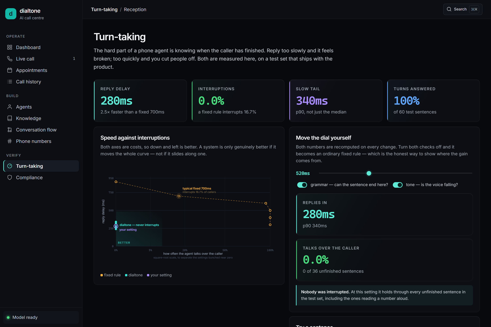
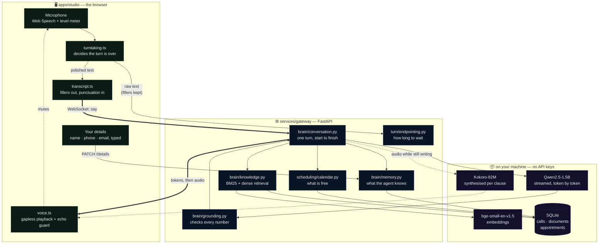
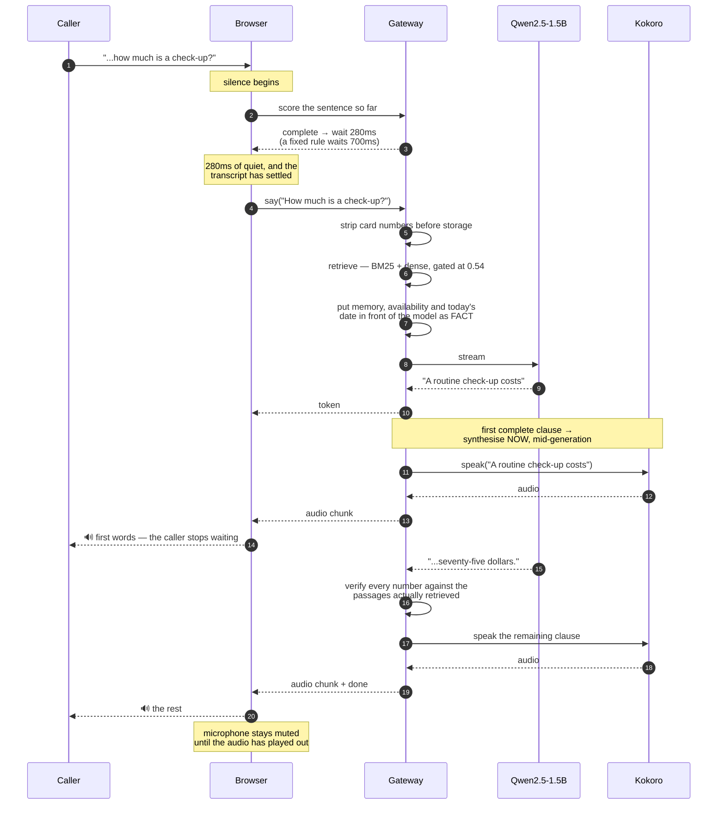
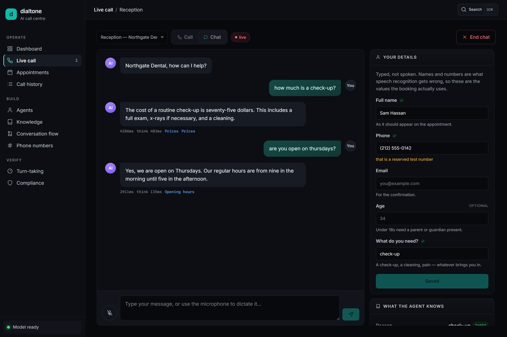
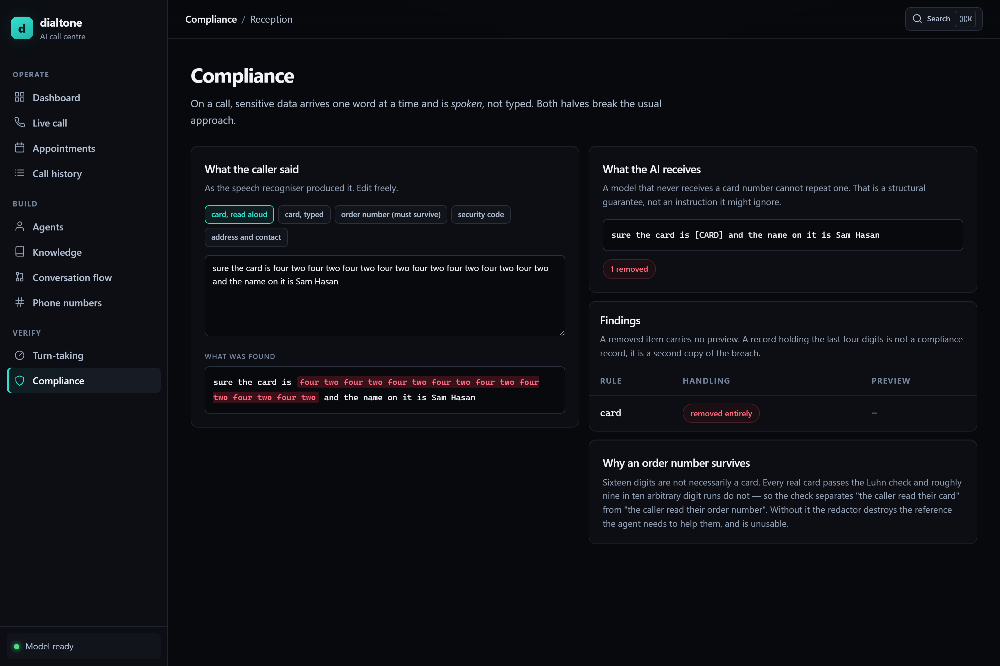
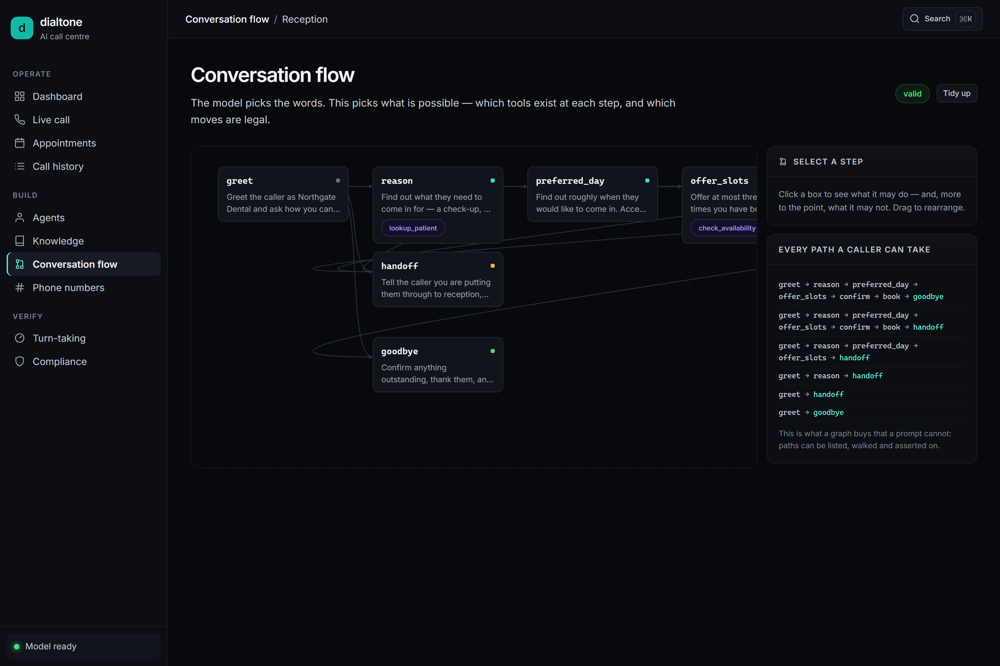
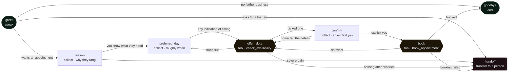
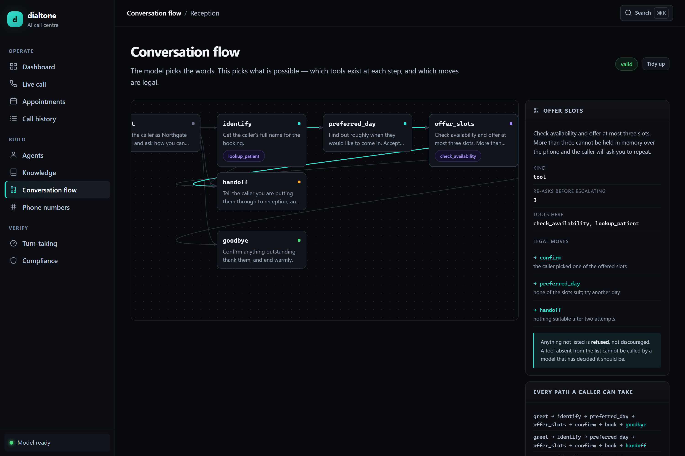
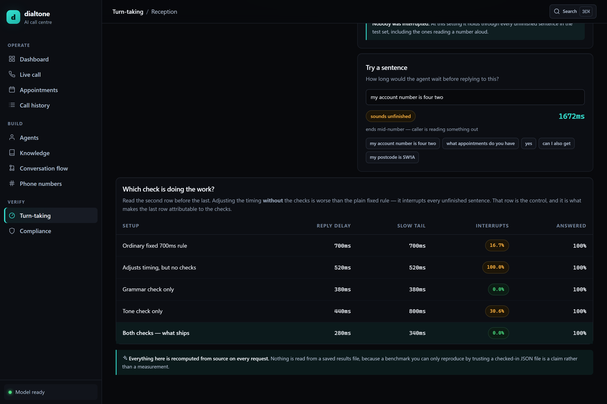

<div align="center">

# dialtone

**An AI phone agent that knows when you have finished talking.**

[](#run-it)
[](#run-it)
[](#run-it)
[](LICENSE)

</div>

---

## What is this?

Software for building AI agents that answer phone calls — like Retell.ai or Vapi.

You can talk to it. It answers, in a real voice, and it **books an appointment** into a database
you can go and look at afterwards.

The hard part of a phone agent is not the AI. It is knowing **when the caller has stopped
speaking** so the agent can reply. Reply too slowly and the call feels broken. Reply too quickly
and you cut the caller off mid-sentence.

dialtone measures both, and publishes the trade-off.

Everything runs on your own machine. No API keys, no GPU, nothing paid.

---

## The problem, in one example

A caller reads out their account number. They pause to think.

```
Caller:  "My account number is four two four two..."
             ↑ pauses for 0.8 seconds

A normal agent:  starts talking. It thinks the caller finished.
dialtone:        stays quiet. The sentence ends on a number, so more is coming.

Caller:  "...four two four two."
```

Most systems wait a **fixed** amount of silence — usually 700 milliseconds — then reply. That
single rule cannot tell these two cases apart:

| The caller said | Finished? | A fixed 700ms rule |
|---|---|---|
| "Yes" | Yes | Waits 700ms. Feels slow. |
| "My account number is four two" | No | Replies. **Cuts them off.** |

dialtone changes how long it waits based on **what the caller actually said**.

---

## The result

Tested on 60 hand-labelled phone turns:

| | Normal fixed 700ms | dialtone |
|---|---:|---:|
| **Speed** — how long before it replies | 700ms | **280ms** |
| **Interruptions** — how often it cuts callers off | 16.7% | **0%** |

**2.5× faster, and it stopped interrupting people.**

Usually these two trade against each other: making an agent faster means cutting people off more
often. Getting both at once is the point of this project.



---

## It actually books the appointment

An agent that has a nice conversation and leaves nothing behind is a demo. This one writes a row.

```
agent   Northgate Dental, how can I help?
caller  hi, I need an appointment, my tooth is hurting
agent   I'm sorry to hear that. What day and time would you prefer?
caller  can I come tomorrow?
agent   Certainly! Tomorrow at eight thirty in the morning would be ideal.
caller  how about eight thirty in the morning
agent   Tomorrow at eight thirty in the morning works perfectly.
[form]  name, phone and email typed on screen
caller  yes, that works
        → NG5EA086 booked

sqlite> select reference, starts_at, patient_name, phone from appointments;
NG5EA086 | 2026-08-24T08:30 | Tasnimul Hasan | (212) 555-0142
```

That transcript is the output of `scripts/booking-e2e.py`, which drives the real API against
the real model and then goes and looks in the database.

Three decisions make it work, and each one came from a call that went wrong.

**The available times are put in the prompt, not behind a tool call.** A 1.5B model asked to emit
a structured tool call gets it right often enough to demo and not often enough to ship. A missed
call produces this, which a real transcript captured:

> *"I'm sorry, but I don't have access to real-time scheduling information."*

Open slots are cheap to compute and short to write down, so the model is simply told them. It
cannot fail to look them up.

**The booking is decided by code, not by the model.** Confirming an appointment is the one
irreversible act on the call. The model proposes a time in its own words; the calendar decides
whether that time is real, free, and unambiguous. A model that hallucinates eight o'clock at a
practice that opens at half past cannot bring an eight o'clock into existence — and that is not
hypothetical, it happened, and the booking was correctly refused.

**Names, phone numbers and email addresses are typed, never spoken.** Speech recognition is good
at sentences and bad at strings. The same call produced *"tasty mulasson"* for a surname and
*"abc iphone com"* for an email address — both plausible English, both wrong, and neither
detectable from the transcript. So the agent is told never to ask for them, the caller types them
on screen, and a typed value permanently outranks anything the agent thinks it heard.

`starts_at` carries a `UNIQUE` constraint. Two callers can both be shown the same free slot; only
one `INSERT` can win, and the loser is told rather than silently double-booked.

---

## Two ways to talk to it

They are not a preference toggle over one behaviour. They are two different products, and the
microphone means something different in each.

| | **Call** | **Chat** |
|---|---|---|
| The agent | speaks, in a neural voice | stays silent |
| The microphone | open the whole time | fills the box, and stops |
| Who decides you finished | the endpointer | you, by pressing send |
| A misheard sentence costs | a wasted turn | a backspace |

Everything difficult in this repository lives in the Call column. Chat exists because dictating
into a box is a genuinely better way to enter a sentence you want to check before sending — and
conflating the two is what made the microphone feel unpredictable.

---

## How it fits together

Two processes. The browser owns the microphone and the speaker; the gateway owns the model, the
documents and the diary. Everything on a live call goes over one WebSocket, because voice needs
both directions at once and because the first token has to reach the browser before the last one
exists.



Three things in that picture are the whole project.

**The raw transcript and the polished one go different ways.** The endpointer reads the raw text,
because "um" is the strongest single signal that a caller has not finished. The agent reads the
cleaned copy, because "um" is not a question. Sending one string to both is the obvious design
and it is wrong in both directions at once.

**Audio starts before the reply is finished.** The dashed line from the conversation to the
synthesiser fires on the first completed clause, not on the last token. That is the difference
between the caller waiting ~2 seconds and ~600ms.

**The speaker mutes the microphone.** On open speakers the agent hears itself, transcribes it,
and answers it. The guard asks the audio clock directly rather than trusting a flag, because
flags go stale between chunks — which is how an earlier version ended up in conversation with
itself.

---

## One turn, end to end

What happens between you stopping talking and hearing an answer. The numbers are measured on a
laptop CPU, and every one of them overlaps with the next — that is the point.



If any stage waited for the one before it to finish, the caller would sit in silence for the sum
of all of them. [Where the time goes](#where-the-time-goes) has the measured numbers.

---

## Run it

You need Python 3.12+ and Node 20+. No API keys. No GPU. Nothing paid.

```bash
# 1. The backend
cd services/gateway
pip install -e ".[serve,dev]"

pytest                    # 249 tests
dialtone bench ablate     # see the results table
dialtone serve            # starts on http://127.0.0.1:8071

# 2. The web app (in a second terminal)
cd apps/studio
npm install
npm run dev               # open http://localhost:5173
```

Then press **Start call** and talk to it. Ask for an appointment, agree a time, type your details
into the panel on the right, and say yes. Open the **Appointments** screen and it is there.

To watch the whole thing happen without a browser:

```bash
python scripts/booking-e2e.py    # a real call, end to end, then checks the database
```

### Try this first

Ask the system how long it would wait for two different sentences:

```console
$ dialtone bench score "my account number is four two"
completion   0.05  (ends mid-number — caller is reading something out)
threshold    1672ms of silence before responding

$ dialtone bench score "what appointments do you have"
completion   0.88  (WH-question with a fronted object, ending on 'have')
threshold    246ms of silence before responding
```

Same system. It waits **6.8× longer** for the person reading a number, because that sentence
clearly is not finished.

---

## How it decides

Three checks run on every 20 milliseconds of audio:

| Check | Question it asks | Example |
|---|---|---|
| **Silence** | How long have they been quiet? | Everyone does this one |
| **Grammar** | Can this sentence end here? | "my name is" → no, keep waiting |
| **Tone** | Is their voice going down? | Voice rising → they are continuing |

The waiting time slides between **160ms** (clearly finished) and **1800ms** (clearly
mid-sentence).

**It uses rules, not a machine-learning model.** Three reasons:

- Fast enough to run on every single audio frame.
- Needs no GPU, and cannot make things up.
- When it cuts someone off, you can read the rule that caused it and fix it.

### Do the checks actually help?

We turned each one off to find out:

| Setup | Speed | Cuts callers off |
|---|---:|---:|
| Normal fixed 700ms | 700ms | 16.7% |
| **Adjusts timing, but no checks** | 520ms | **100%** ← worse than doing nothing |
| Grammar check only | 380ms | 0% |
| Tone check only | 440ms | 30.6% |
| **Both (what ships)** | **280ms** | **0%** |

Look at row two. Adjusting the timing **without** the checks is worse than the plain fixed rule
— it interrupts every single unfinished sentence. That row proves the improvement comes from the
checks, not from luckier settings.

---

## Interruptions: the bug most phone agents have

When a caller talks over the agent, you stop the audio. Simple. But there is a trap.

The agent **wrote** a whole sentence. The caller only **heard** the part that played before they
cut in.

```
Agent wrote:   "I've got Tuesday at nine, Tuesday at ten thirty,
                Wednesday at noon, and Friday at four."
Caller heard:  "I've got Tuesday at…"          ← they cut in here
```

If you save the full sentence into the conversation history, the AI now believes it offered four
appointment times. Two turns later it says *"as I mentioned, Tuesday at ten thirty…"* — and the
caller has no idea what it is talking about.

**dialtone saves what the caller heard, not what the AI wrote.**



It also tells the difference between a real interruption and someone just saying **"mm-hmm"**.
An agent that stops every time you say "uh huh" can never finish a sentence.

---

## Testing phone calls without a phone

Testing a voice agent normally needs a person, a phone, and 40 seconds per attempt. You cannot
run that in CI, so the tricky cases get tested once by hand and then never again.

dialtone includes a **call simulator**. It replays scripted callers through the real code and
gives the same answer every time.

```console
$ dialtone call run account-number

Caller reads a number aloud  (account-number)
  turns 2   median endpoint 1680ms (vs 700ms fixed)   false cutoffs 0
```

This call is **slower** than normal — 1680ms — and that is correct. The caller paused twice
while reading their account number, and dialtone waited. A fixed rule would have replied over
them both times and captured half a number.

Waiting costs time. We show that cost instead of hiding it, and there is a test asserting this
call is slower than a normal one.

Six scenarios ship:

| Scenario | What it checks |
|---|---|
| `booking` | A normal call, start to finish |
| `account-number` | Caller pauses while reading numbers |
| `barge-in` | Caller talks over the agent |
| `backchannel` | Caller says "mm-hmm" — agent should keep going |
| `card-number` | Caller reads a card number aloud |
| `packet-loss` | A bad phone line dropping 3% of the audio |

---

## Keeping card numbers out of the system

People read card numbers **out loud** on phone calls. Nobody says "4242424242424242" — they say
*"four two, four two, four two…"*.

Most redaction tools look for digits. On a phone call there are no digits, so they find nothing
and report that the call was clean. That is the worst possible failure.



dialtone converts spoken numbers into digits first, then removes them.

**It also keeps what should be kept.** An order number looks just like a card number. dialtone
runs the Luhn check — a maths test that every real card passes and most random numbers fail:

| Caller says | What happens |
|---|---|
| A real card number | Removed, replaced with `[CARD]` |
| An order number | Kept — the agent needs it to help them |

The AI model never receives the card number at all. A model that never sees a card number cannot
repeat one back.

---

## Controlling what the agent can do

You describe the call as a **flow chart**. Each step says what the agent is trying to achieve and
which tools it is allowed to use.



The AI still chooses its own words. The chart only controls what is **possible**.



```console
$ dialtone flow show
node           kind      collects       tools reachable here                 edges
greet          speak                    —                                    3
reason         collect   reason         lookup_patient                       2
preferred_day  collect   preferred_day  —                                    1
offer_slots    tool                     check_availability                   3
confirm        collect   confirmed      —                                    2
book           tool                     book_appointment, send_confirmation  3
handoff        transfer                 —                                    0
goodbye        end                      —                                    0

paths (6):
  greet → reason → preferred_day → offer_slots → confirm → book → goodbye
  greet → reason → preferred_day → offer_slots → confirm → book → handoff
  greet → reason → preferred_day → offer_slots → handoff
  greet → reason → handoff
  greet → handoff
  greet → goodbye
```

Every path is enumerated, so "what can this agent actually do?" has an answer you can read
rather than a prompt you have to trust. `dialtone flow validate` fails the build on a node
nothing reaches or a collect step with no way out.

`book_appointment` exists at the `book` step and nowhere else. If the AI decides to book an
appointment during the greeting, it cannot — the tool is not in the list it was given.

**No step asks for the caller's name**, and that is the most important thing about this chart.
One used to: *"Get the caller's full name for the booking"*, with a pattern to validate it and
retries when it failed. It read well and it was wrong — a name spoken down a phone line and
transcribed by a browser is not a name. A step's objective is the strongest instruction the model
gets, so while that one existed, no rule anywhere else in the prompt could stop the agent asking.
It asked on every single call. Deleting it is what fixed it.



### Slow tools need covering

On a phone call, a slow database lookup is **silence**, and silence sounds like the line dropped.
So every tool declares how slow it is:

| Speed | Time | What happens |
|---|---|---|
| `INSTANT` | under 0.15s | Just run it |
| `FAST` | under 0.8s | Fits inside a natural pause |
| `SLOW` | under 4s | Agent says *"let me check that"* **first** |
| `BACKGROUND` | over 4s | Cannot wait — promise a callback |

### Not booking things twice

If the line drops between "book it" and the confirmation, the caller rings back. Without care,
they get booked twice.

Two separate guards, because they fail in different ways:

- **Within a call**, tools that change something get an **idempotency key**. Same key means same
  action. There is a test for this, plus a second test proving it *does* double-book without the
  key — otherwise the first test is not measuring the guard.
- **Across calls**, `appointments.starts_at` is `UNIQUE`. Two callers can both be looking at the
  same free slot; the database decides, and the second `INSERT` fails rather than succeeding
  quietly.

A caller who says *"yes, great, thanks"* three times has agreed once, and there is a test for
that too.

---

## The test set



60 phone turns, labelled by hand, **published in full**. A benchmark with a secret test set is
just marketing.

They cover what actually goes wrong on phone lines: numbers read out loud, sentences ending in
"and", filler words like "um", short answers like "yes", and thinking pauses.

60 items is small, and we say so. It is enough to show the method works. It is not enough to
settle an argument between vendors. [docs/EVALUATION.md](docs/EVALUATION.md) lists every
limitation, including the ones that weaken the claim.

---

## All commands

```
dialtone bench ablate         which checks are doing the work
dialtone bench sweep          the full speed vs interruptions curve
dialtone bench score TEXT     why it would or would not reply to this sentence
dialtone bench corpus         the test set and its scores
dialtone call list            available test scenarios
dialtone call run ID -v       replay one call, step by step
dialtone flow show            the flow chart, its rules, and every possible path
dialtone flow validate        find broken flows before a real call does
dialtone redact TEXT          what the AI sees, and what gets removed
dialtone serve                start the API
```

---

## Project layout

```
services/gateway/src/dialtone/
├── turn/
│   ├── endpointing.py    decides when the caller has finished
│   └── bargein.py        handles interruptions and "mm-hmm"
├── brain/
│   ├── conversation.py   one call, start to finish
│   ├── memory.py         what the agent knows, and how it came to know it
│   ├── knowledge.py      retrieval over the company's own documents
│   ├── grounding.py      checks every number the agent says against them
│   ├── speakable.py      "$45" → "forty five dollars"
│   └── llm.py            the local model, and the rules every agent gets
├── scheduling/
│   └── calendar.py       what is free, what is taken, "tomorrow morning" → a time
├── pipeline/             the listen → think → speak loop
├── flow/                 the flow chart and its rules
├── tools/                tool speed classes and safety guards
├── telephony/            phone line handling and the call simulator
├── compliance/           removing card numbers and personal data
├── speech/               neural speech synthesis (Kokoro-82M)
├── store/                SQLite: agents, calls, documents, appointments
├── eval/                 the benchmark and the test set
├── sim/                  full simulated calls
├── agents/               a complete worked example agent
└── server/               the API for the web app

apps/studio/src/
├── views/                one file per screen
├── turntaking.ts         the browser half of the endpointer — pure, and tested
├── voice.ts              microphone, echo guard, gapless audio playback
└── transcript.ts         stripping "um" without stripping "very very"

scripts/
├── booking-e2e.py        a real call against the real model, then checks the database
└── smoke.mjs             every screen in a real browser, with a fake microphone
```

### Where the time goes

A caller stops believing it is a conversation after about 700–800ms of silence. You only fit in
that budget if every stage starts on the **first word** of the previous stage, instead of waiting
for it to finish:

| Stage | If you wait | If you stream | Budget |
|---|---:|---:|---:|
| Deciding the caller finished | 700ms | 280ms | 300ms |
| Converting speech to text | 380ms | 55ms | 80ms |
| AI's first word | 640ms | 210ms | 240ms |
| First audio out | 340ms | 65ms | 100ms |
| **Total** | **~2060ms** | **~610ms** | **720ms** |

The "if you wait" column is what you get from writing the obvious code. It is why many voice
agents feel like a walkie-talkie.

---

## Tests

249 in the gateway, 80 in the browser, plus two scripts that drive the whole thing for real.
Each is named after the problem it prevents, not the function it calls:

```
test_a_dropped_line_does_not_double_charge_the_caller
test_history_records_what_the_caller_heard_not_what_was_generated
test_a_spoken_card_does_not_destroy_the_following_word_boundary
test_holding_through_a_number_costs_latency_and_that_is_the_point
test_the_day_survives_the_turn_that_names_the_hour
test_two_callers_cannot_have_the_same_slot
test_a_time_that_does_not_exist_is_refused_even_on_a_free_day
```

```bash
cd services/gateway && pytest          # 249
cd apps/studio      && npm test        # 80
npm run smoke                          # every screen, in Chromium, with a fake microphone
python scripts/booking-e2e.py          # a real call, then a look in the database
```

Some exist because the code was wrong first:

| The bug | Why it mattered |
|---|---|
| The simulator ran callers at 3000 words per minute | Every speed measurement taken against it was meaningless |
| Audio length was counted as it played, not up front | Interruption handling silently did nothing at all |
| Replaying a test call changed the test call | Running it twice tested less the second time |
| One "mm-hmm" got counted 63 times | The check runs 50 times a second and nothing reset it |
| The agent transcribed its own voice and replied to it | Open speakers. Flags went stale between audio chunks, so the guard now asks the audio clock |
| One spoken sentence became four replies | Two clocks disagreed and nothing tracked what had already been sent |
| `sam@example.com` set the appointment reason to "check-up" | "example" contains "exam", and the match was on substrings |
| The caller was told a free morning was full | The prompt said so whenever they had not yet named an hour — which is most of the time |

---

## What this is not

**It is not a phone line.** Nothing here dials out or receives a real call. The telephony layer
is an interface plus a simulator; connecting a provider like Twilio means implementing six
functions. Everything above that layer is real.

**The model is small, and it shows.** Qwen2.5-1.5B runs on a laptop CPU, which is the point —
you can run this repository without paying anyone. It is also why the code, not the model, holds
every irreversible decision: the model proposes a time, the calendar decides whether that time
exists, and the database decides whether it is still free. Watch it long enough and you will see
it word something oddly. You will not see it book an appointment that does not exist.

---

## Licence

MIT. See [LICENSE](LICENSE).
